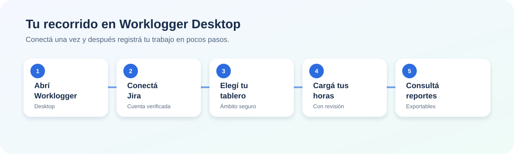
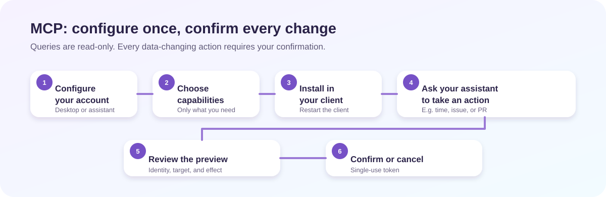

# Guía de uso de Worklogger

Worklogger sirve para dos cosas complementarias:

- **Desktop:** ver tareas, registrar tus horas y consultar reportes desde una aplicación.
- **MCP:** habilitar esas capacidades para un asistente compatible, como Codex o Claude.

No hace falta usar MCP para aprovechar Desktop. Si usás MCP, seguís operando con
tu propia cuenta y tus permisos de Jira o Bitbucket.



## Elegí tu camino

| Quiero… | Empezá por… |
| --- | --- |
| Cargar horas y consultar reportes | [Usar Desktop](#usar-desktop) |
| Pedirle tareas a Codex, Claude u otro asistente | [Usar MCP](#usar-mcp) |
| Hacer ambas cosas | Configurá Desktop y después activá MCP desde **Configuración → MCP** |

## Antes de empezar

Para Desktop necesitás una cuenta de Jira Cloud y un API token personal. Podés
[crearlo desde la seguridad de tu cuenta Atlassian](https://support.atlassian.com/atlassian-account/docs/manage-api-tokens-for-your-atlassian-account/).
Para MCP standalone sólo necesitás Node para ejecutar el instalador público de
npm; no necesitás una cuenta ni un token de Worklogger.

No compartas tu token. Worklogger lo guarda en el almacén seguro de tu equipo;
no lo incorpora al perfil, a los archivos de configuración de clientes MCP ni a
los reportes.

Si tu equipo te dio un `organization.json`, podés importarlo. Ese archivo define
módulos, ámbitos y límites compartidos, pero **no** incluye cuentas ni secretos.

---

## Usar Desktop

### 1. Conectá tu cuenta de Jira

1. Abrí Worklogger. En el primer inicio aparece **Conectá Jira**.
2. Si recibiste un archivo de configuración, elegí **Importar JSON**. Si no,
   completá la conexión manualmente.
3. Ingresá el sitio de Jira, tu correo de Atlassian y tu API token.
4. Elegí **Verificar y buscar tableros**.
5. Seleccioná un tablero, tu objetivo semanal y la zona horaria.
6. Elegí **Guardar y entrar**.

Worklogger primero verifica la cuenta y recién después permite elegir el
tablero. Ese tablero define el ámbito desde el que vas a consultar tareas y
cargar horas.

> Consejo: la zona horaria hace que cada carga quede en el día correcto. Revisala
> especialmente si trabajás para un equipo en otro huso horario.

### 2. Cargá horas

1. Entrá al módulo **Jira** y elegí **+ Cargar horas**.
2. Seleccioná una tarea. Primero aparecen tus tareas recientes del sprint que
   todavía no tienen horas esa semana; también podés buscar otra tarea accesible.
3. Indicá fecha, horas, minutos y —si querés— un comentario breve.
4. Elegí **Revisar carga**.
5. Confirmá los datos. La carga se crea sólo para tu cuenta autenticada.

En la misma vista podés navegar entre semanas, ver el progreso hacia tu objetivo
y revisar las cargas individuales. Para modificar o borrar una carga,
seleccioná **Editar** o **Eliminar**. Antes de borrar, Worklogger vuelve a
comprobar que la carga sea tuya.

### 3. Consultá reportes

Si tu edición tiene el módulo **Reportes**, entrá desde la barra lateral y elegí
el período a analizar. La vista individual contiene solamente tus horas. La
vista de equipo aparece sólo cuando está habilitada y tu cuenta tiene permiso;
es siempre de sólo lectura.

Podés exportar la vista a XLSX o PDF. Las exportaciones conservan el vínculo con
las tareas de Jira para que los datos se puedan rastrear.

### 4. Configurá MCP desde Desktop

Desktop también puede dejar Worklogger disponible para tus asistentes:

1. Abrí **Configuración** y elegí la sección **MCP**.
2. Activá únicamente las capacidades que necesitás, por ejemplo **Consultar mis
   horas** o **Consultar issues**.
3. Verificá que el servidor figure como **Servidor disponible**.
4. En **Clientes MCP**, buscá el cliente que usás. El cliente debe haberse
   abierto al menos una vez en esa computadora.
5. Elegí **Instalar**, revisá el destino y confirmá.
6. Cerrá y volvé a abrir el cliente MCP.

La instalación modifica sólo la entrada `worklogger` del cliente elegido. No
agrega tokens al archivo del cliente ni modifica sus otras integraciones.

---

## Usar MCP

MCP conecta Worklogger con asistentes como Codex, Claude Code, Claude Desktop,
Cursor y Windsurf. El servidor corre localmente y usa las capacidades que vos
habilitaste.



### Opción A: ya usás Desktop

Seguí los pasos de [Configurar MCP desde Desktop](#4-configurá-mcp-desde-desktop).
Es la opción más simple porque reutiliza la configuración de tu cuenta y te
permite instalar en los clientes detectados desde una pantalla gráfica.

### Opción B: instalación standalone

Usá esta opción si no usás Desktop o si preferís configurar MCP desde una
terminal.

1. Abrí una terminal en el mismo entorno donde se ejecuta tu cliente.
   - Para una aplicación Windows, usá PowerShell.
   - Para Codex o Claude Code dentro de WSL, usá la terminal de esa distribución
     WSL.
2. Abrí el instalador público. No necesitás una cuenta ni un token de
   Worklogger:

   ```shell
   npx @santiv343/worklogger
   ```

   Si usaste una versión anterior desde GitHub Packages, ejecutá antes una vez
   `npm config delete @santiv343:registry`.

3. Elegí los módulos y capacidades que necesitás. El asistente verifica tu
   cuenta y descubre los recursos permitidos antes de ofrecerlos.
   En Bitbucket podés guardar reviewers adicionales y la preferencia de borrar
   la rama fuente al mergear para futuros PRs.
4. Elegí el cliente detectado, revisá el archivo que se modificará y confirmá.
5. Reiniciá el cliente MCP para que tome la nueva configuración.

Si tu equipo usa un perfil compartido, podés iniciar el asistente con él:

```shell
# Windows
npx @santiv343/worklogger setup --profile C:\ruta\organization.json

# Linux o WSL
npx @santiv343/worklogger setup --profile /ruta/organization.json
```

El perfil se copia como configuración local validada. Cada persona ingresa su
propio correo y token durante el asistente.

### Comandos útiles

| Comando | Para qué sirve |
| --- | --- |
| `npx @santiv343/worklogger` | Abrir el asistente interactivo. |
| `npx @santiv343/worklogger status` | Ver estado, módulos, ruta instalada y clientes detectados. |
| `npx @santiv343/worklogger clients` | Instalar o quitar Worklogger de un cliente sin repetir el onboarding. |
| `npx @santiv343/worklogger skills` | Instalar o actualizar las skills de flujo de Worklogger. |
| `npx @santiv343/worklogger uninstall` | Quitar sólo el registro y la configuración MCP de Worklogger. |

`uninstall` no borra tus horas en Jira, tus pull requests ni las credenciales de
Desktop. Tampoco elimina integraciones ajenas que usen el mismo cliente.

### Skills de flujo

En la TUI elegí **Instalar skills de flujo para asistentes** o ejecutá
`npx @santiv343/worklogger skills`. Instala las mismas tres skills portables
(`worklogger-jira`, `worklogger-daily` y `worklogger-delivery`) para Agent
Skills compartidas, Codex, Claude Code y Windsurf. Cada instalación queda en el
directorio global propio del asistente y no modifica ninguna skill ajena.

Cursor usa Rules y Commands en lugar de este formato de Skill, por lo que no se
instala un archivo incompatible allí.

---

## Pedir acciones desde un asistente

Una vez registrado el servidor y reiniciado el cliente, hablale al asistente en
lenguaje natural. Ejemplos:

- “Mostrame mis horas de esta semana.”
- “¿Qué tareas del sprint tengo sin horas cargadas?”
- “Buscá el issue PROJ-123 y resumilo.”
- “Listá los pull requests abiertos del repositorio permitido.”

Para acciones que cambian datos, el asistente siempre tiene que pegar una
sección visible `Vista previa` y pedir tu confirmación. No alcanza con decir
que fue previsualizada ni con dejar el detalle dentro de una llamada técnica
plegada. Ejemplos: cargar horas, comentar o editar un issue, crear o aprobar un
pull request, mergear o declinar un pull request.

Al crear un pull request, Worklogger agrega los reviewers predeterminados
efectivos de Bitbucket —los del repositorio y los heredados del proyecto— a los
reviewers que indiques, sin duplicarlos. La preview también muestra si la rama
fuente se cerrará; si no se especifica, queda conservada.

| Momento | Qué vas a ver | Qué hacer |
| --- | --- | --- |
| Consulta | Resultado de Jira o Bitbucket | Revisalo; no cambia nada. |
| Vista previa | El bloque visible con tu identidad, destino y efecto exacto | Revisá los datos y posibles duplicados. |
| Confirmación | Pedido explícito de confirmar | Confirmá sólo si sigue siendo correcto. |
| Ejecución | Resultado o error del proveedor | Si hubo cambios remotos, el asistente te lo informa. |

La confirmación es de un solo uso y está ligada al estado mostrado. Si el issue
o el pull request cambió entre la vista previa y la confirmación, Worklogger no
ejecuta la acción con información vieja.

---

## Qué puede hacer MCP

Lo que aparece en tu cliente depende de la edición instalada, del perfil, de
las capacidades activadas y de tus permisos reales.

| Integración | Consultas | Acciones confirmadas |
| --- | --- | --- |
| Jira | Issues, búsquedas, campos editables, transiciones, horas propias y tareas sin horas | Cargar horas propias; editar, comentar o cambiar un issue si habilitaste esas capacidades. |
| Bitbucket | Repositorios permitidos, pull requests y actividad | Crear o editar PRs, comentar, revisar, mergear o declinar sólo si habilitaste cada capacidad. |

Worklogger nunca acepta otra persona como autor de una carga de horas: opera
siempre como la cuenta autenticada. Las horas de terceros, si Jira permite
verlas, son de sólo lectura.

---

## Seguridad y privacidad

- Nunca pegues tokens en un chat, un ticket, un perfil `organization.json` ni
  un archivo de configuración de un cliente MCP.
- `organization.json` se puede compartir; `mcp.json` y `config.json` son
  locales de cada persona y no se comparten.
- El perfil puede restringir módulos y ámbitos, pero no puede otorgar permisos
  que Jira o Bitbucket no te dieron.
- Cancelar una confirmación no hace cambios.
- Después de una actualización de Worklogger, reiniciá tu cliente MCP para que
  use la versión nueva del servidor.

## Problemas frecuentes

| Situación | Qué hacer |
| --- | --- |
| No aparece mi cliente MCP | Abrilo al menos una vez y repetí la detección. Ejecutá el asistente en el mismo entorno: PowerShell para apps Windows o WSL para clientes dentro de WSL. |
| El botón de instalar está deshabilitado | Activá al menos una capacidad y completá las credenciales de todos los proveedores activos. |
| No aparece una herramienta en el asistente | Revisá que el módulo esté incluido, permitido por el perfil y habilitado en MCP; después reiniciá el cliente. |
| El asistente pide confirmación | Es el comportamiento esperado para una acción que modifica datos. Revisá identidad, destino y efecto antes de responder. |
| Una acción se rechaza después de confirmar | El recurso pudo haber cambiado o tu permiso puede no alcanzar. Volvé a consultar y generá una vista previa nueva. |
| Quiero quitar MCP | Usá **Quitar** en Desktop o `npx @santiv343/worklogger uninstall`. Sólo se elimina el registro de Worklogger. |

## Siguiente paso

Empezá por conectar Jira en Desktop o por ejecutar el asistente MCP. Para saber
qué configuración tenés activa, usá la pantalla **Configuración → MCP** o el
comando `npx @santiv343/worklogger status`.
